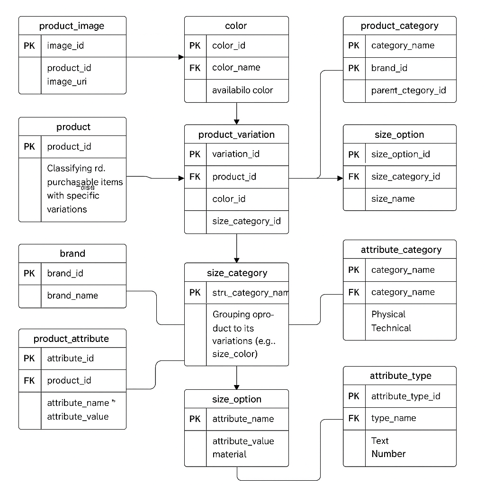

# 🛍️ E-Commerce Database Project

This project is a collaborative effort to design and implement a normalized e-commerce database system using MySQL and ERD tools.

## 🔧 ERD Diagram

> View the live ERD on [dbdiagram.io](https://dbdiagram.io)

## 🗃️ Tables Included

- `brand`
- `product_category`
- `product`
- `product_image`
- `color`
- `size_category`
- `size_option`
- `product_variation`
- `product_item`
- `attribute_category`
- `attribute_type`
- `product_attribute`

## 📂 Files

- `ecommerce.sql`: SQL script to create the database schema.
- `images/erd-diagram.png`: Screenshot of the ERD.

## 🤝 Team Collaboration

- We used GitHub for version control and documentation.
- Weekly check-ins to discuss design and data flow.
- Everyone contributed to the ERD, SQL, and testing.

## 🚀 Setup Instructions

1. Clone the repo
2. Import `ecommerce.sql` into your MySQL server
3. Explore the schema and customize as needed

## 📬 Contact

If you have questions, open an issue or contact a team member.

